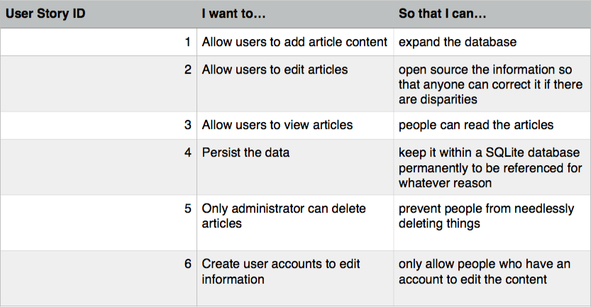
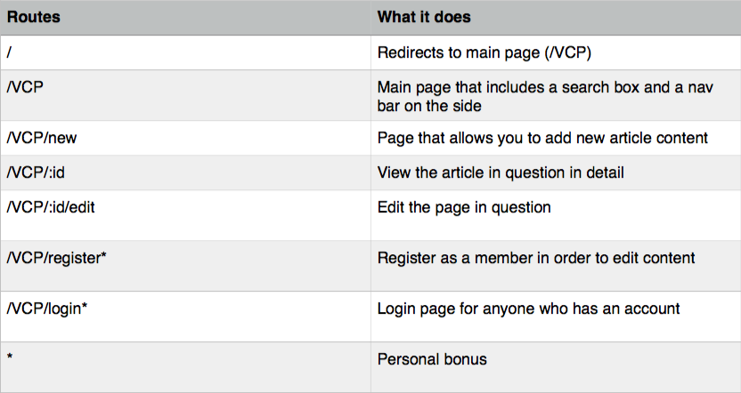

# project2

# User Story

<!-- User Story to appear as a table image from pages -->
Inline-style:

# ERD

<!-- ERD to appear as an image -->
Inline-style:

<!-- draw.io img -->

# Routes

<!-- another image file -->

Inline-style:

